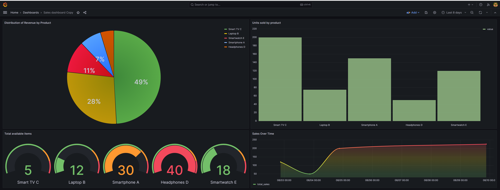

## This project aims to demonstrate how to set up grafana + postgres with docker-compose.


You can read more on my <b>medium</b> article.

- [`Exploring Data Visualization with Grafana/PostgreSQL/Docker`](https://ricardohsmello.medium.com/exploring-data-visualization-with-grafana-postgresql-docker-7d9cb3fae5e9)

# Built With

- [`Grafana`](https://grafana.com/) - Analytics and monitoring platform
- [`Docker`](https://www.docker.com/) - Containerized Application Deployment
- [`PostgreSQL`](https://www.postgresql.org/) - Relational Database Management

# Prerequisites
- [`Docker Compose`](https://docs.docker.com/compose/) - Multi-Container Orchestration

# Usage

### Clone repository
```
$ git clone https://https://github.com/ricardohsmello/grafana-docker.git
```
### Starting container:

```
$ cd grafana-docker
$ docker-compose up -d

```
### Accessing grafana

- http://localhost:3000

```
